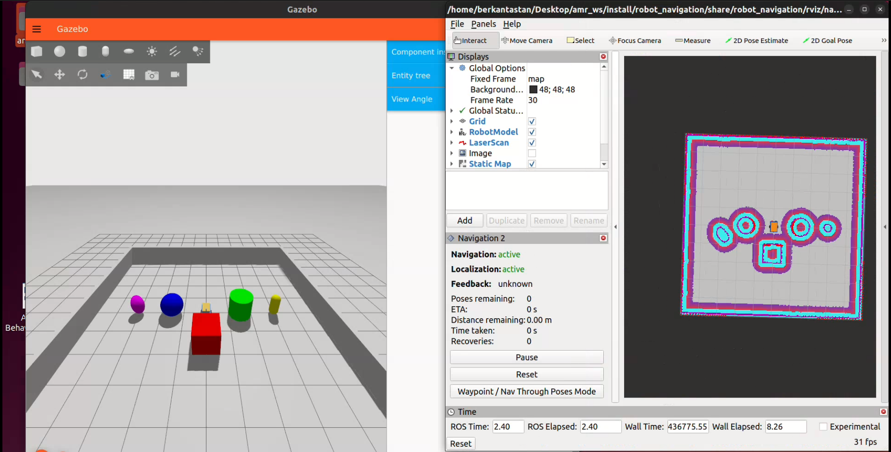
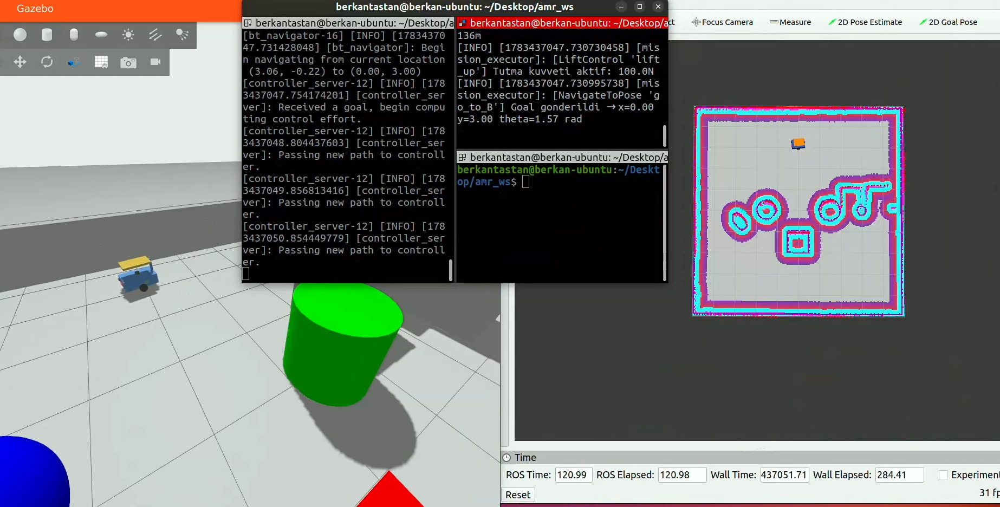
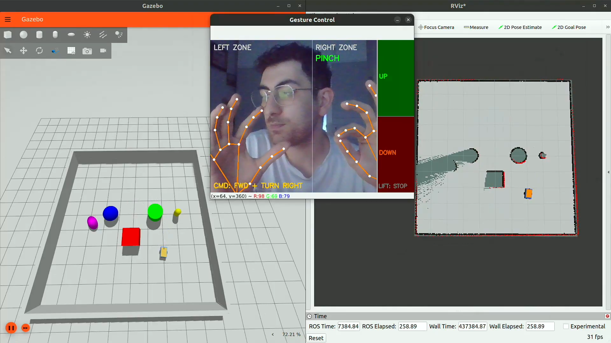

# Factory AMR — ROS 2 Autonomous Mobile Robot

Depoda yük taşıyan, engellerden kaçınan ve el hareketleriyle manuel kontrol edilebilen otonom mobil robot (AMR) simülasyonu. Gazebo Fortress üzerinde diferansiyel sürüşlü bir platform; SLAM ile harita çıkarıyor, Nav2 ile navigasyon yapıyor, BehaviorTree.CPP ile "yük al → taşı → bırak" görevini otonom yürütüyor ve MediaPipe tabanlı el hareketi tanıma ile de sürülebiliyor.

<p align="center">
  <a href="https://www.youtube.com/watch?v=XV6nqqHECoE">
    
  </a>
</p>

## Demo

▶️ [Proje demo videosu — YouTube](https://www.youtube.com/watch?v=XV6nqqHECoE)

## Kullanılan Teknolojiler


## Özellikler

- **URDF/Xacro robot modeli** — diferansiyel tahrikli şasi, kaldırma (lift) mekanizması, IMU, RGB-D kamera ve 2D LiDAR
- **Gazebo Fortress simülasyonu** — `ros2_control` ile diff-drive ve effort-controlled lift joint
- **SLAM (slam_toolbox)** ile harita oluşturma, **Nav2** ile lokalizasyon ve yol planlama
- **BehaviorTree.CPP** tabanlı görev yöneticisi: `NavigateToPose → LiftControl (yukarı) → NavigateToPose → LiftControl (aşağı) → Wait`
- **MediaPipe Hands** ile gerçek zamanlı el hareketi tanıma → robotu ileri/geri/dön ve lift yukarı/aşağı olarak sürme

## Paket Yapısı

| Paket | Açıklama |
|---|---|
| `robot_description` | URDF/Xacro robot modeli, Gazebo entegrasyonu, sensör tanımları |
| `robot_bringup` | Tüm sistemi (Gazebo + robot_state_publisher + ros2_control + RViz) tek launch ile ayağa kaldırır |
| `robot_navigation` | SLAM haritalama ve Nav2 navigasyon launch/parametreleri |
| `robot_mission_control` | BehaviorTree.CPP ile otonom görev yürütücü (NavigateToPose, LiftControl, WaitSeconds action node'ları) |
| `robot_gesture_control` | MediaPipe tabanlı el hareketi tanıma → `cmd_vel` / lift komutu |

## Kurulum

```bash
# Bağımlılıklar: ROS 2 Humble, Gazebo Fortress, Nav2, slam_toolbox, BehaviorTree.CPP v3, MediaPipe
sudo apt install ros-humble-nav2-bringup ros-humble-slam-toolbox ros-humble-behaviortree-cpp-v3
pip install mediapipe opencv-python

cd ~/Desktop/amr_ws
colcon build --symlink-install
source install/setup.bash
```

## Çalıştırma


**1. Haritalama (SLAM)** ile ortamı keşfet ve haritayı kaydet, ardından **Nav2** ile navigasyonu başlat

```bash
ros2 launch robot_navigation mapping.launch.py - rviz2 
ros2 launch robot_navigation nav2.launch.py
```

<p align="center">
  
</p>

**2. Otonom görev** — BehaviorTree ile A noktasından yük al, B noktasına taşı, bırak

```bash
ros2 launch robot_mission_control mission.launch.py
```

<p align="center">
  
</p>

**3. El hareketiyle manuel kontrol**

```bash
ros2 run robot_gesture_control hands_control_node
```

<p align="center">
  
</p>

## Lisans

Apache-2.0
